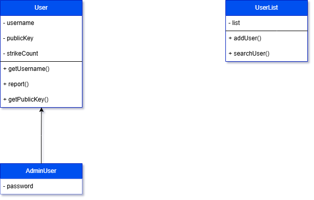

# ChatApp Backend

Backend for ChatApp project for COP3003 - Spring 2026

---

## Team Members

- Keila Lopez Sosa
- Kolby Goar
- Alberto Cuch
- James Mill

---

## How to Run

### Requirements

- C++ compiler
- GNU Make

### Steps

1. Clone the respository
   `git clone https://github.com/alberinfo-2nd/ChatappBackend`
2. Open an Adminstrative Powershell then install chocolatey with this command
   `Set-ExecutionPolicy Bypass -Scope Process -Force; [System.Net.ServicePointManager]::SecurityProtocol = [System.Net.ServicePointManager]::SecurityProtocol -bor 3072; iex ((New-Object System.Net.WebClient).DownloadString('https://community.chocolatey.org/install.ps1'))`
3. verify if the install was successful by typing
   `choco --version`
4. Install make by running
   `choco install make -y`
5. Build program by running `make all` from the source directory in the project

---

## Features

- Administrator moderation (selected admin users can disconnect an active user from the server)
- Self-destrcuting messaging (A history system which clears automatically upon exit)
- Anonoymous chatting (Users will obtain a temporary identity via chosen username, and be able to talk with end-to-end encryption)
- Strike system (Admin useres will get notified when a certain user has been reported three times and will be able to disconnect them from the system)
- One-to-one private messaging (Users can select another user from the active user list to start a private conversation)

---

## Class Structure

### UML Diagram

- 

---

## OOP Concepts Used

### Ecapsulation

- Data members like adminPassword, public_key or username are kept private. Access controlled via public getter and setter methods and only available to each object.

### Inheritance

- AdminUser inherits from the User base class, sharing common traits such as username, while having unique behaviors such as passwords which are retrieved from a text file.

### Polymorphism

- Implemented through virtual and override functions. I.e., login changes for normal and admin users, where admin users require a text file lookup for the password hash.

---

## Acknowledgments

- **[cpp-httplib](https://github.com/yhirose/cpp-httplib)** - Provides core HTTPS functionality

- **[json](https://github.com/nlohmann/json)** - Provides core json functionality

- **[sha256](https://github.com/kibonga/sha256-cpp)** - Provies hash capabilities for the admin passwords

---
